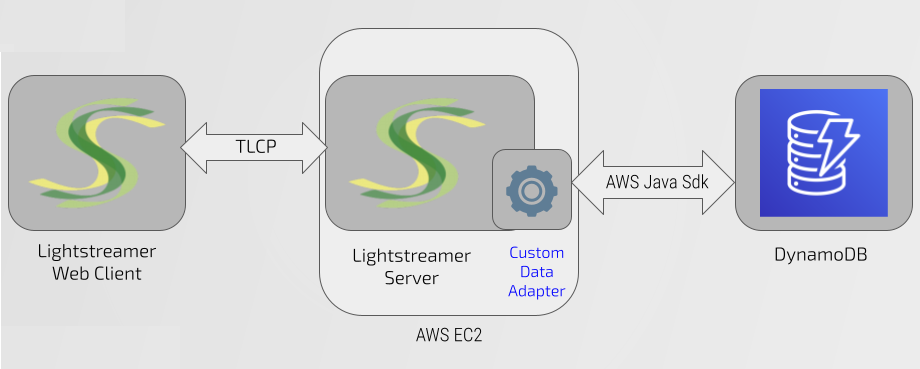

# Lightstreamer - DynamoDB Demo - Kotlin Adapter

This project includes the resources needed to develop the Data and Metadata Adapters for the Lightstreamer DynamoDB Demo pluggable into Lightstreamer Server 

<br>

The Demo simulates a basic departures board with a few rows which represent information on flights departing from a hypothetical airport.
The data are simulated with a random generator provided in this project and writed in two [Amazon DynamoDB](https://aws.amazon.com/en/dynamodb/) tables.

As an example of a client using this adapter, you may refer to the [Lightstreamer - DynamoDB Demo - Web Client](https://github.com/Lightstreamer/Lightstreamer-example-DynamoDB-client-javascript) and view the corresponding [Live Demo](https://demos.lightstreamer.com/DynamoDBDemo/).

## Details

The source code of the projects is basically divided into two packages: 

- demo, that implements the operations with DynamoDB both as regards reading the updates to be injected into the Lightstreamer server but also the simulator of flights information. In particular the following classes are defined:
    - `DemoPublisher.kt`, implementing the simulator generating and writing flight monitor data into two DynamoDB tables;
    - `DynamoData.kt`, once subscribed by the clients, reading data from the DynamoDB tables and pushing as updates into the Lightstreamer server.

<br>

- server, that implements the Lightstreamer in-process adapters based on the [Java In-Process Adapter API ](https://sdk.lightstreamer.com/ls-adapter-inprocess/7.3.1/api/index.html). in particular:
    - `DemoDepartureProvider.kt` implements the Data Adapter publishing the simulated flights information;
    - `DemoDataProvider.kt` implements the Data Adapter publishing the current time of the simulation;
    - `DemoMetadataProvider.kt` implements a very basic Metadata Adapter for the demo.

## Build and Install

To build and install your own version of these adapters you have two options:
either use [Gradle](https://gradle.org/install/) (or other build tools) to take care of dependencies and building (recommended) or gather the necessary jars yourself and build it manually.
For the sake of simplicity only the Maven case is detailed here.

### Gradle

You can easily build and run this application using Gradle through the `build.gradle` file located in the root folder of this project. As an alternative, you can use an alternative build tool (e.g. Gradle, Ivy, etc.).

Assuming Gradle is installed and available in your path you can build the demo by running
```sh 
 $gradle dist 
```

If the task complete successful it also created a `build/dist` folder, ready to be deployed under the `LS_HOME/adapters`.

### AWS DynamoDB

Both the Data Adapters and the simulator uses two DynamoDB tables that you have to create empty in an AWS region of your choice:

    - DemoCurrentTimeData
    - DemoDeparturesData


### AWS CLI

Please note that you should also make sure that on the server running the adapters the [AWS Command Line Interface](https://docs.aws.amazon.com/cli/latest/userguide/cli-chap-welcome.html) version 2 is installed and properly configured with credentials allowing Read/Write access to the DynamoDB tables for the region you have used in the previous step.

## See Also

### Clients Using This Adapter
<!-- START RELATED_ENTRIES -->

* [Lightstreamer - DynamoDB Demo - Web Client](https://github.com/Lightstreamer/Lightstreamer-example-DynamoDB-client-javascript)

<!-- END RELATED_ENTRIES -->

### Related Projects

* [LiteralBasedProvider Metadata Adapter](https://github.com/Lightstreamer/Lightstreamer-lib-adapter-java-inprocess#literalbasedprovider-metadata-adapter)

## Lightstreamer Compatibility Notes

- Compatible with Lightstreamer SDK for Java In-Process Adapters since 7.3.